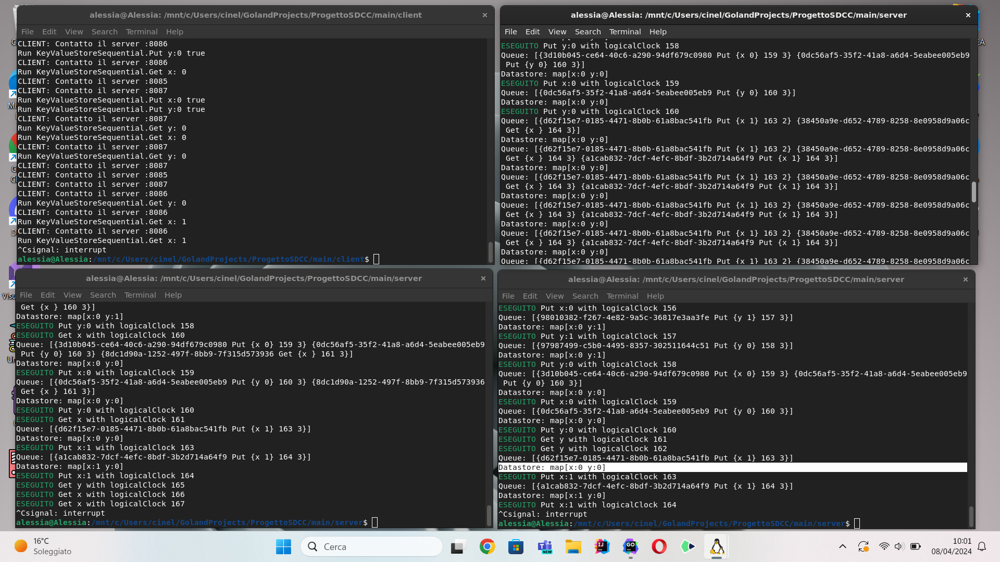

**ALGORITMO CLOCK LOGICO SCALARE**
1) Tutti gli N processi hanno il clock = 0
2) Per ogni evento interno il clock aumenta di uno
3) Se si riceve un messaggio da un altro processo:
   1) Si prende il max clock logico
   2) Lo si incrementa di uno
   3) Si esegue l'evento di receive(m)
4) Se si invia un messaggio ad un altro processo:
   1) Si incrementa il clock di uno
   2) Allega al messaggio il clock logico
   3) Esegue l'evento di send(m)

Algoritmo distribuito MULTICAST TOT. ORDINATO:

Ogni messaggio abbia come timestamp il clock logico scalare del processo che lo invia.
1. pi invia in multicast (incluso se stesso) il messaggio di update msg_i.
2. msg_i viene posto da ogni processo destinatario pj in una coda locale queue_j, ordinata in base al valore del timestamp.
3. pj invia in multicast un messaggio di ack della ricezione di msg_i.
4. pj consegna msg_i all’applicazione se msg_i è in testa a queue_j, tutti gli ack relativi a msg_i sono stati ricevuti
da pj e, per ogni processo pk, c’è un messaggio msg_k in queue_j con timestamp maggiore di quello di msg_i
(quest’ultima condizione sta a indicare che nessun altro processo può inviare in multicast un messaggio con
timestamp potenzialmente minore o uguale a quello di msg_i).

*PROBLEMA*
- Mi arriva prima un ack e dopo la richiesta di append => Ignoro e rispondo "false" cosi che mi venga re-inviata.
- Errore Pacchetto 163: Due dei tre server replica ricevono tutti e 3 gli ack, uno soltanto non ha ricevuto un ack (Strano): gli altri due server vanno avanti nell'elaborazione dei pacchetti perché hanno tutti gli ack dei successivi, il server che ha perso l'ack rimane bloccato. => Le assunzioni per eseguire il multicast totalmente ordinato prevedono che la comunicazione sia affidabile, potrei risolvere il problema allo stesso modo di cui sopra? La parte di codice più indagata è la sincronizzazione con l'incremento dell'ack.
 